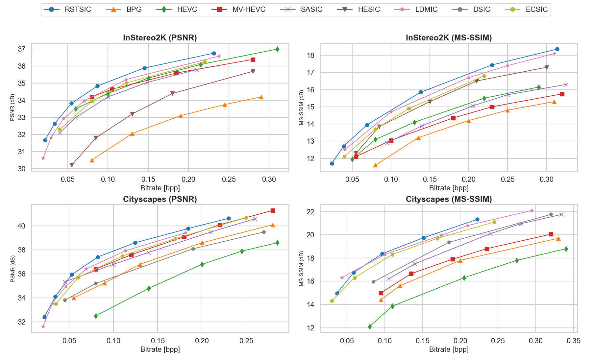

# RSTSIC: Reparameterized Swin Transformer Stereo Image Compression

Official implementation of **RSTSIC: Reparameterized Swin Transformer Stereo Image Compression**

##  Abstract

Stereo image compression faces challenges in adequately exploiting inter-view correlations and contextual information due to occlusions, disparity variations, and computational overhead. 
To effectively extract non-local contextual information and efficiently capture cross-view feature dependency from stereo images, we propose Reparameterized Swin Transformer Stereo Image Compression framework, integrating Reparameterized Swin Block (RSB) and Cross Feature Enhancement Modules (CFEMs) in the joint decoder. CFEMs enable bidirectional feature interaction for exploiting inter-view feature redundancy, while RSB captures long-range dependencies and non-local contextual information via window-based self-attention, maintaining inference efficiency through structural reparameterization. The RSTSIC model achieves competitive compression performance on both Cityscapes and InStereo2K datasets, outperforming benchmark models across PSNR and MS-SSIM metrics, while demonstrating significant efficiency improvements with at least 58.57% reduction in model parameters and 36.53% decrease in FLOPs compared to state-of-the-art compression models.
Ablation studies confirm the necessity of CFEMs and RSB for efficient compression and perceptual fidelity. The framework’s computational efficiency and robustness make it suitable for real-time applications such as autonomous driving and VR streaming. 

##  Key Features
- **State-of-the-Art Performance**: Outperforms traditional codecs and learning-based compression methods on PSNR and MS-SSIM metrics.
- **High Efficiency**: Structural reparameterization reduces inference complexity without sacrificing performance.
- **Robust Generalization**: Validated on both urban (Cityscapes) and indoor (InStereo2K) stereo datasets.
- **Real-Time Ready**: Low latency and lightweight design.

##  Evaluation Results

